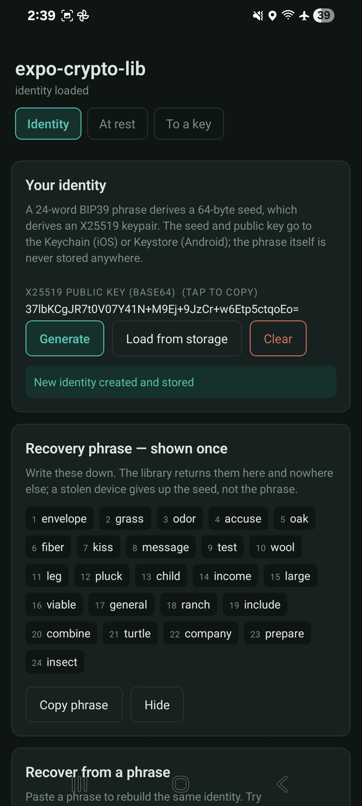
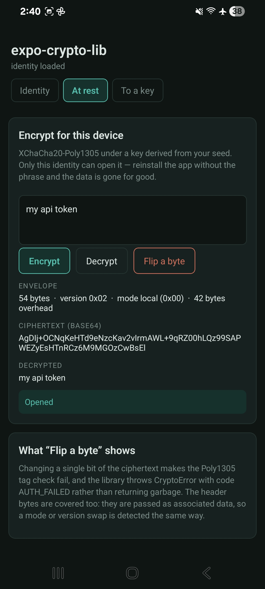
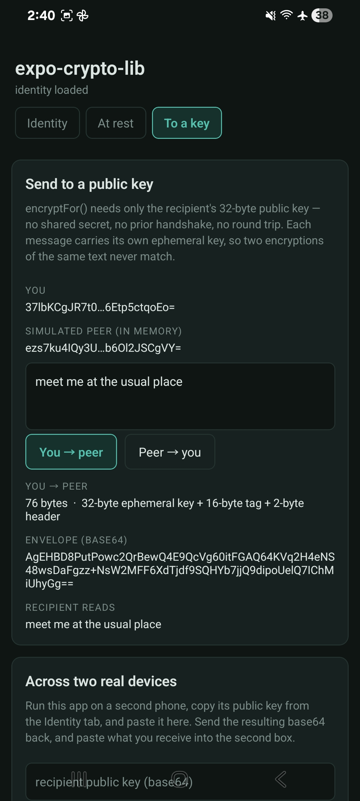

# expo-crypto-lib

[](https://github.com/mjryan1-honesttech/expo-crypto-lib/actions/workflows/ci.yml)
[](https://www.npmjs.com/package/expo-crypto-lib)
[](https://expo.dev)

If your Expo or React Native app needs to encrypt sensitive data—and you want users to recover their keys if they lose their phone—this library gives you authenticated encryption with BIP39 mnemonic-based key recovery. No native iOS or Android code, no prebuild. Works in Node too.

> **Upgrading from 1.x?** v2 is a clean break. Data encrypted with 1.0.2 cannot be read by v2, and 1.0.2 recovery phrases do not derive v2 keys. Decrypt anything you need with 1.0.2 before upgrading. See [Why v2 breaks compatibility](#why-v2-breaks-compatibility).

### Why would I want this?

For client-side encrypted storage. The library derives an X25519 keypair and a symmetric key from a 24-word BIP39 recovery phrase. Because derivation is deterministic, the same phrase always regenerates the same keys — so a user who saved their phrase can restore access on a new device. The phrase is a standard BIP39 phrase, so it also works with any other BIP39-compatible tool.

Encryption is **authenticated** (AEAD): if a ciphertext is modified by even one bit, decryption fails with an error rather than returning wrong plaintext.

### What does it store, and where?

Two items go into secure storage (Keychain on iOS, Keystore-backed storage on Android, via `expo-secure-store`):

- the 64-byte **seed** — secret, and the item worth gating behind biometrics
- the 32-byte **public key** — not secret, readable without prompting

**The recovery phrase is never written to storage.** `generate()` returns it once; show it to the user and let them save it. That way, compromising the device does not also hand over the phrase.

You can require biometric or device authentication for access, and restrict when entries are readable:

```ts
import * as SecureStore from 'expo-secure-store';
import { createCryptoManager } from 'expo-crypto-lib';

const manager = createCryptoManager({
  platform: 'expo',
  storageOptions: {
    requireAuthentication: true,
    authenticationPrompt: 'Unlock your encryption keys',
    keychainAccessible: SecureStore.WHEN_UNLOCKED_THIS_DEVICE_ONLY,
  },
});
```

To share entries between **your own** apps on iOS, pass `accessGroup` (requires a matching keychain-sharing entitlement). There is no cross-app equivalent on Android: an app cannot read another app's Keystore-backed entries.

### I lost my recovery phrase! How can I recover it?

You cannot. Without the 24-word phrase there is no way to regenerate the keypair. Generate a new one and use it going forward — and this time, _<u>keep your phrase safe!</u>_

## See it running

From the [`demo/`](demo) app on a physical Android device in Expo Go — no native build, no prebuild.

| `generate()` | `encryptLocal()` | `encryptFor()` |
|:--:|:--:|:--:|
|  |  |  |
| A 24-word BIP39 phrase, returned once and never written to storage, deriving an X25519 keypair. | `my api token` sealed into 54 bytes — 42 of them envelope overhead — then opened again. | HPKE to a recipient's public key: 76 bytes, no handshake and no round trip. |

Three more, including the empty state and the two-device exchange, are in [`demo/screenshots/`](demo/screenshots). Every key and phrase visible in them is a throwaway demo value.

Run it yourself:

```bash
cd demo && ./dev.sh start   # prints a QR code; scan it with Expo Go
```

## Install

```bash
npm install expo-crypto-lib
```

For Expo apps, install peer dependencies:

```bash
npx expo install expo-crypto expo-secure-store
```

**Requirements:** React Native 0.70+ / Expo SDK 47+ with the Hermes engine (X25519 needs `BigInt`), or Node 20.19.4+.

## Quick start

**Expo / React Native:**

```ts
import { createCryptoManager } from 'expo-crypto-lib';

const manager = createCryptoManager({ platform: 'expo' });

// First run: create an identity and show the phrase to the user, once.
const mnemonic = await manager.generate();

const encrypted = manager.encryptLocal(fileBytes);
const decrypted = manager.decryptLocal(encrypted);

// Later runs: load the stored identity.
if (await manager.load()) {
  // ready to encrypt and decrypt
}
```

**Node:**

```ts
const { createCryptoManager } = require('expo-crypto-lib');

const manager = createCryptoManager({ platform: 'node' });
await manager.generate();
const encrypted = manager.encryptLocal(data);
const decrypted = manager.decryptLocal(encrypted);
```

**Recovery on a new device:**

```ts
await manager.recover(mnemonicFromUser); // throws CryptoError('INVALID_MNEMONIC') on a typo
```

**Encrypting to someone else's public key:**

```ts
const sealed = manager.encryptFor(recipientPublicKey, data); // 32 raw bytes
const opened = recipientManager.decrypt(sealed);
```

See [docs/getting-started.md](docs/getting-started.md) for build options and the full API.

## Use cases

- **Sensitive data at rest** — Encrypt credentials or PII before storing in AsyncStorage
- **Encrypted backup / transit** — Encrypt files, send to your backend or another device, decrypt after recovery
- **Account recovery** — A 24-word BIP39 phrase restores keys on a new device
- **Offline-first cache** — Encrypted local cache for health, financial, or other sensitive records
- **Multi-user apps** — User-scoped keys via `storageKeyPrefix` or custom storage adapters
- **Tests / Node** — Run crypto flows in Node without an Expo app

Full examples in [docs/use-cases.md](docs/use-cases.md).

## Features

- **X25519 + HPKE** ([RFC 9180](https://www.rfc-editor.org/rfc/rfc9180.html) base mode, suite `DHKEM(X25519, HKDF-SHA256) / HKDF-SHA256 / ChaCha20Poly1305`) for encrypting to a public key — interoperable with any standard HPKE implementation
- **XChaCha20-Poly1305** for at-rest encryption, keyed from the seed
- **Authenticated encryption throughout** — tampering is detected, with a versioned header bound in as associated data
- **Standard BIP39** 24-word phrases with checksum validation, so a typo is rejected instead of silently deriving the wrong key
- **Instant key derivation** — under 10 ms, versus seconds for RSA
- **Typed errors** — every failure throws `CryptoError` with a `code`; nothing fails silently
- **Pure JavaScript** — no native modules, no prebuild, runs in Expo Go
- Adapters for Expo (`expo-secure-store`, `expo-crypto`) and Node

## Errors

Every failure throws `CryptoError` with a `code` you can branch on:

| code | meaning |
| --- | --- |
| `NO_KEYS` | No identity loaded — call `generate()`, `recover()`, or `load()` |
| `AUTH_FAILED` | Wrong key, or the ciphertext was modified |
| `BAD_FORMAT` | Envelope truncated, wrong mode, or stored key malformed |
| `UNSUPPORTED_VERSION` | Envelope written by a different format version |
| `INVALID_MNEMONIC` | Phrase failed BIP39 checksum validation |
| `STORAGE_FAILED` | The underlying secure storage failed |
| `VALUE_TOO_LARGE` | Value exceeds what the platform's secure storage accepts |

## Why v2 breaks compatibility

v1 had defects that could not be fixed while staying compatible:

- Ciphertexts used **AES-256-CBC with no authentication**, so tampering was undetectable.
- Seed derivation was a **single SHA-512** instead of BIP39's PBKDF2-HMAC-SHA512 × 2048, so a passphrase cost one hash per guess.
- The mnemonic wordlist was a **corrupted 2058-word variant** of BIP39 (it contained `voyal`, which is not a word, and was missing 13 real BIP39 words), had **no checksum**, and packed the last word from only 3 bits — so word 24 was always one of the first eight words. A typo that landed on another valid word silently derived a different key.
- The recovery phrase was **written to secure storage** on every keygen.
- `RECOMMENDED_KEY_SIZE = 3072` produced a 2498-byte private key PEM, above the ~2048-byte value size iOS accepts.

Because v1 phrases were not valid BIP39 and v1 seed derivation was unsound, there is no honest migration path that preserves either. v2 fixes all of the above and drops RSA, `node-forge`, and the `react-native-modpow` workaround entirely.

[docs/v1-to-v2.md](docs/v1-to-v2.md) has the full breakdown: primitives, storage, envelope format, measured performance, the API migration map, and the remaining caveats.

## Troubleshooting

- **Module not found: expo-secure-store / expo-crypto** — Run `npx expo install expo-secure-store expo-crypto`
- **`BigInt` errors on Android** — Enable the Hermes engine (default since RN 0.70)
- **Error in Node with createExpoKeyStorage** — Use `createNodeKeyStorage()` and `createNodeRandomValues()` for Node
- **EBADENGINE / unsupported Node** — Dev tooling needs Node 20.19.4+; use `nvm use` or `fnm use`

## Docs

- [Getting started](docs/getting-started.md) — Install, build, API, dependencies
- [Use cases](docs/use-cases.md) — Example scenarios with code
- [v1 to v2](docs/v1-to-v2.md) — What changed, why, and the API migration map
- [Publishing](docs/publishing.md) — npm, GitHub Packages

**Source**: [https://github.com/mjryan1-honesttech/expo-crypto-lib](https://github.com/mjryan1-honesttech/expo-crypto-lib)

## License

MIT

Maintained by Matthew Ryan @ HonestTech
Community contributions welcome, see [Contributing](CONTRIBUTING.md) for how to submit for a pull request.
